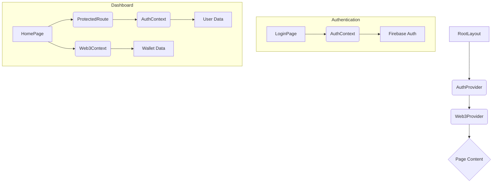

# Codebase Overview

This document provides a high-level overview of the Realmkin application's architecture and data flow.

## 1. Project Structure

The project is a Next.js application built with TypeScript, Tailwind CSS, Firebase, and Ethers.js. The key directories are:

- **`src/app`**: Contains the main application pages and layouts.
  - **`layout.tsx`**: The root layout, which wraps all pages and includes the `AuthProvider` and `Web3Provider`.
  - **`page.tsx`**: The main dashboard page, accessible only to authenticated users.
  - **`login/page.tsx`**: The login page for user authentication.
- **`src/components`**: Shared React components, such as `ProtectedRoute`.
- **`src/contexts`**: React context providers for managing global state.
  - **`AuthContext.tsx`**: Manages user authentication state using Firebase.
  - **`Web3Context.tsx`**: Handles Web3 wallet connections and interactions with the Ethereum blockchain.
- **`src/lib`**: Utility functions and libraries, including the Firebase configuration.
- **`public`**: Static assets like images and fonts.

## 2. Authentication Flow

Authentication is managed by Firebase. Here's the flow:

1. The user navigates to the `/login` page.
2. The user enters their email and password.
3. The `handleLogin` function in `src/app/login/page.tsx` calls `signInWithEmailAndPassword` from Firebase.
4. If the login is successful, the user is redirected to the main dashboard (`/`).
5. The `AuthContext` listens for changes in the authentication state and makes the user object available throughout the application.
6. The `ProtectedRoute` component ensures that only authenticated users can access the dashboard.

## 3. Web3 Integration

The application integrates with the Ethereum blockchain using Ethers.js. The `Web3Context` manages the wallet connection and provider.

1. The user clicks the "Link Wallet" button on the dashboard.
2. The `connectWallet` function in `src/contexts/Web3Context.tsx` prompts the user to connect their wallet (e.g., MetaMask).
3. Once connected, the user's wallet address is stored in the `Web3Context`.
4. The dashboard displays the user's wallet address and NFT information.

## 4. Data Flow

The data flow is primarily managed through React context and component props.

## 5. Potential Improvements

- **Error Handling**: The error handling in `Web3Context.tsx` can be improved by providing more specific feedback to the user. For example, instead of a generic "Link Failed" message, the application could offer more targeted advice based on the error code.

- **State Management**: The current state management relies on React context, which is suitable for this application's size. However, for more complex scenarios, consider a dedicated state management library like Redux or Zustand to handle more complex state interactions.

- **Component Library**: The project could benefit from a more robust and organized component library. Creating a centralized directory for UI components would improve consistency, reusability, and maintainability.

- **Testing**: The codebase currently lacks tests. Implementing unit tests for critical components like `AuthContext` and `Web3Context` and integration tests for user flows like login and wallet connection would significantly improve code quality and prevent regressions.

- **Code Duplication**: There is some code duplication in the `page.tsx` file, particularly in the NFT card section. This could be refactored into a reusable `NFTCard` component to simplify the code and improve maintainability.

- **Environment Variables**: The application should use environment variables to store sensitive information like Firebase API keys, rather than hardcoding them in the source code. This is a critical security improvement.
